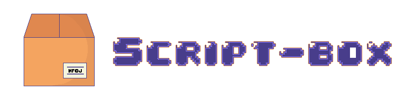

	</a>

Coleção de scripts em Bash e Python para simplificar tarefas do dia a dia. Soluções eficientes e fáceis de usar para automatizar diversas ações.

## 💾 Conteúdos
Segue a lista de scritps:

<strong>Bash</strong>
- Teste de Conexâo;
- Update de Sistema;
- Lista de Tarefas.

<strong>Python</strong>
- Teste de Conexão.

### 🗂️ Em andamento: 
- Criação de Pastas e Arquivos;
- Informações da Máquina (TOP);
- ...
